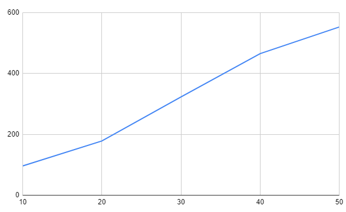
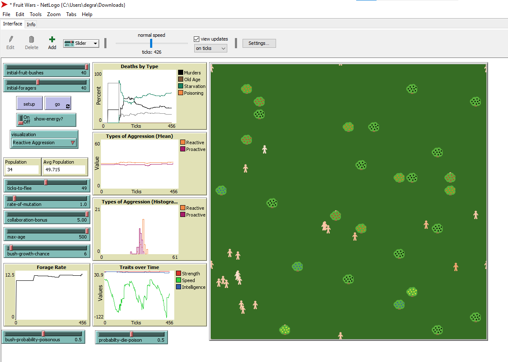

## Комп'ютерні системи імітаційного моделювання
## СПм-22-5, **Шевчук Євген Вадимович**
### Лабораторна робота №**2**. Редагування імітаційних моделей у середовищі NetLogo

 

### Варіант 13, модель у середовищі NetLogo:
[Fruit Wars](https://www.netlogoweb.org/launch#http://www.netlogoweb.org/assets/modelslib/Sample%20Models/Social%20Science/Economics/Fruit%20Wars.nlogo)

 

### Вербальний опис моделі:
Модель Fruit Wars має на меті продемонструвати, як економічне середовище з ненульовою сумою може заохочувати співпрацю та перешкоджати насильству. Здобувачі корму блукають по карті в пошуках плодових чагарників. Коли вони прибувають до плодового куща, вони отримують енергію шляхом пошуку їжі, доки плодовий кущ не вичерпає ресурси. Ці здобувачі розмножуються та передають свої характеристики нащадкам після збору певної кількості енергії. Вони також приймають рішення на основі спадкових параметрів щодо того, як взаємодіяти з іншими здобувачами, які шукають їжу. Здобувачі їжі можуть співпрацювати, погрожувати, воювати чи тікати за різних обставин.

У моделі здобувачі можуть або співпрацювати, або боротися на основі спадкових атрибутів агресії. Параметр бонус-співпраці у моделі контролює, наскільки корисною є співпраця з точки зору пошуку їжі, тому слід очікувати, що еволюційна рівновага системи рухається в бік збирачів з менш жорстокими тенденціями, коли модель запускається з вищими налаштуваннями бонусу-співпраці.

### Початкові Параметри
- **initial-fruit-bushes** визначає початкову кількість плодових кущів
- **initial-foragers** визначає початкову кількість здобувачів їжі

### Параметри візуалізації
- **show-energy** відображати кількість енергії кожного збирача
- **visualisation** змінює тональність кольору агента в залежності від значення вибранного параметра, чим світліший тон кольору тим вище значення параметру

### Керуючі параметри:
- **ticks-to-flee** кількість ходів пересування збирача в випадкову сторону перед тим як він почне шукати кущі
- **rate-of-mutation** вірогідність зміни геному і передачі його до потомства
- **collaboration-bonus** бонус поживності одного куща для декількох збирачів
- **max-age** максимальна кількість ходів яку здобувач може прожити
- **bush-grow-chance** визначає шанс на появу нового плодового куща в кожний хід

### Внутрішні параметри:

- **speed** швидкість руху збирача
- **proactive-aggression** ймовірність захисту
- **reactive-aggression** ймовірність загрози
- **energy** метаболічна енергія збирача
- **genome** список що кодує успадковані параметри збирача
- **foraging** чи збирає збирач зараз фрукти
- **fleeing** чи збирач втікає
- **fleeing-turns** кількість ходів для втікання
- **age** вік збирача в ходах
- **strength** сила для боротьби
- **intelligence** інтеллект для группового збирання
- **amount** кількість енергії в кущі

### Показники роботи системи:
- загальна кількість збирачив
- середня кількість збирачів
- швидкість збирання
- швидкість змін сили, інтелекту і швидкості збирачів
- швидкість збирання
- відсоток вбивств від загальної кількості смертей
- відсоток смертей від голоду від загальної кількості смертей
- відсоток смертей від старості від загальної кількості смертей
- реактивна/проактивна агрессія

### Зміни до коду згідно варіанту
Обов'язкові зміни:

- При генерації куща, з деякою ймовірністю (вказаною користувачем - "bush-probability-poisonous") він може стати отруйним.

- Після завершення збору ресурсів з куща, якщо кущ був отруйний, здобувач або помирає, або виживає (ймовірність виживання залежить від сили здобувача - "max-strenght").

- Якщо здобувач їжі вижив після отруєння, він отримує зниження параметра швидкості на певну кількість тактів (вказану у внутрішніх параметрах - "poison-recovery-ticks").

- Отруйні кущі мають чорний колір ягід на мапі.

- На графіку "Deaths By Type" додається новий тип смертності "від отруєння": червоним кольором.

Додаткові зміни:

- Додано ймовірність померти від отруєння(вказаною користувачем - "probability-die-poison") отруїтися при поїданні кущів (зазначена у внутрішніх параметрах, як певна вірогідність). Параметр probability-die-poison використовується для визначення ймовірності смерті здобувача після отруєння в результаті споживання отруйних ягід.

#### Зазвичай probability-die-poison задається як значення від 0 до 1, де:

- 0 означає, що здобувач не помре від отруєння і завжди виживає, навіть якщо він споживає отруйну їжу.
- 1 означає, що здобувач завжди помре від отруєння, навіть якщо він споживає невелику кількість отруйної їжі.
- Інші значення між 0 і 1 визначають ймовірність смерті при різних умовах і можуть давати різні результати при моделюванні.

### Обчислювані експеременти
Вплив шансу росту фруктових кущів на популяцію збирачів з додотковим параметром у вигляді отруйних кущів.
Дослідити, як зміна ймовірності появи нових фруктових кущів (bush-growth-chance) впливає на середню популяцію збирачів на 2000 тактів, враховуючи додавання отруйних кущів у модель.

Параметри моделі: initial-fruit-bushes: 40 initial-foragers: 40 ticks-to-flee: 49 rate-of-mutation: 1 collaboration-bonus: 5 max-age: 500 bush-probability-poisonous: 0.5(доданий) probability-die-poison: 0.5(доданий)

<table>
<thead>
<tr><th>Шанс появи куща</th><th>Середнє населення</th></tr>
</thead>
<tbody>
<tr><td>10</td><td>96.23</td></tr>
<tr><td>20</td><td>178.29</td></tr>
<tr><td>30</td><td>322.89</td></tr>
<tr><td>40</td><td>465.35</td></tr>
<tr><td>50</td><td>552.85</td></tr>
</tbody>
</table>

### Результати:

Можно зробити висновки що середня популяція буде меньше на всіх етапах, але так само буде збільшуватися в залежності від збільшення шансу появи кущів

Приклад оновленого інтерфейсу:

